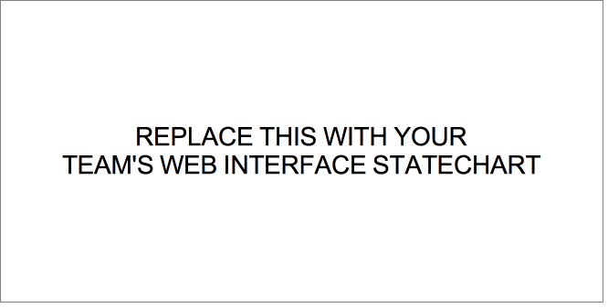

# PROJECT Design Documentation

> The following template provides the headings for your Design Documentation.  As you edit each section make sure you remove these commentary 'blockquotes'; the lines that start with a > character.

# Team Information
* Team name: TEAMNAME
* Team members
  * MEMBER1
  * MEMBER2
  * MEMBER3
  * MEMBER4

## Executive Summary

This is a summary of the project.

### Purpose
> Provide a very brief statement about the project and the most important user group and user goals.

### Glossary and Acronyms
> Provide a table of terms and acronyms.

| Term | Definition |
|------|------------|
| VO | Value Object |

## Requirements

This section describes the features of the application.

> In this section you do not need to be exhaustive and list every story.  Focus on top-level features from the Vision document and maybe Epics and critical Stories.

### Definition of MVP
> Provide a simple description of the Minimum Viable Product.

### MVP Features
> Provide a list of top-level Epics and/or Stories of the MVP.

### Roadmap of Enhancements
> Provide a list of top-level features in the order you plan to consider them.

## Application Domain

This section describes the application domain.

> Replace the placeholder image above with your team's own domain model. 

> Provide a high-level overview of the domain for this application. You can discuss the more important domain entities and their relationship to each other.

## Architecture

This section describes the application architecture.

### Summary

The following Tiers/Layers model shows a high-level view of the webapp's architecture.

As a web application, the user interacts with the system using a browser.  The client-side
of the UI is composed of HTML pages with some minimal CSS for styling the page.  There is also
some JavaScript that has been provided to the team by the architect.

The server-side tiers include the UI Tier that is composed of UI Controllers and Views.
Controllers are built using the Spark framework and View are built using the FreeMarker framework.  The Application and Model tiers are built using plain-old Java objects (POJOs).

Details of the components within these tiers are supplied below

### Overview of User Interface

This section describes the web interface flow; this is how the user views and interacts
with the WebCheckers application.

> Replace the placeholder image above with your team's own web interface state model. 

> Provide a summary of the application's user interface.  Describe, from the user's perspective, the flow of the pages in the web application.

### UI Tier
> Provide a summary of the Server-side UI tier of your architecture.
> Describe the types of components in the tier and describe their responsibilities.

#### Static models
> Provide one or more static models (UML class or object diagrams) with some details such as critical attributes and methods.

#### Dynamic models
> Provide any dynamic models, such as state and sequence diagrams, as is relevant to a particularly significant user story.
> For example, in WebCheckers you might create a sequence diagram of the `POST /validateMove` HTTP request processing or you might use a state diagram if the Game component uses a state machine to manage the game.

### Application Tier
> Provide a summary of the Application tier of your architecture.
> Describe the types of components in the tier and describe their responsibilities.

#### Static models
> Provide one or more static models (UML class or object diagrams) with some details such as critical attributes and methods.

#### Dynamic models
> Provide any dynamic model, such as state and sequence diagrams, as is relevant to a particularly significant user story.

### Model Tier
> Provide a summary of the Model tier of your architecture.
> Describe the types of components in the tier and describe their responsibilities.

#### Static models
> Provide one or more static models (UML class or object diagrams) with some details such as critical attributes and methods.

#### Dynamic models
> Provide any dynamic model, such as state and sequence diagrams, as is relevant to a particularly significant user story.
